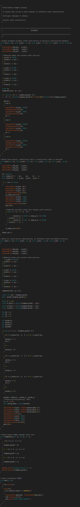

# multitasking-stepper-library

**Library Currently under construction!**

An arduino library to control up to 6 steppers in a multitasking fashion, due to pin limitations in one board. Different speeds, directions, number of steps and acceleration.

Theoretically number of steppers that can be controlled is only limited by the stack memory of the arduino and the number of addresses on the 12C bus, if each motor has a separate encoder which interfaces via I2C.

This means that over 30 motors can be controlled simultaneously with acceptable resposiveness.

